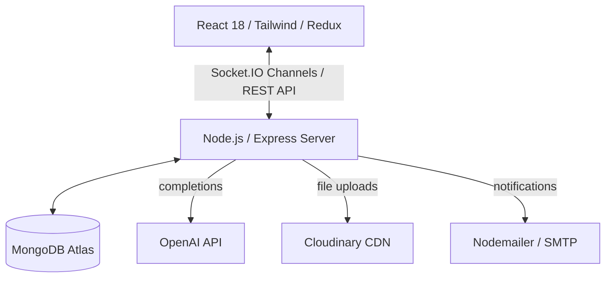
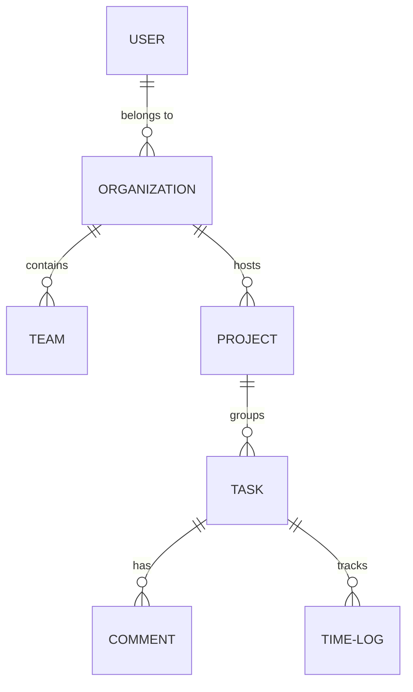

# Taskmind - AI Powered Smart Task Management System

Taskmind is an enterprise-grade, portfolio-worthy project management platform (similar to Jira, ClickUp, and Notion) engineered on the MERN stack with advanced OpenAI integrations and real-time Socket.IO collaboration networks.

---

## Technical Architecture



### Database ER Diagram



---

## Tech Stack

- **Frontend**: React 18, Vite, Redux Toolkit, Tailwind CSS, Material UI, Recharts, Hello-Pangea DnD, Socket.IO Client.
- **Backend**: Node.js, Express.js, MongoDB + Mongoose, JWT + Cookie Session refresh flow, Socket.IO, Nodemailer, OpenAI SDK, PDFKit, XLSX.
- **Deployment**: Docker, Docker Compose, Production-ready static hosting.

---

## Directory Structures

```
taskmind/
├── client/                 # Frontend React 18 / Vite
│   ├── src/
│   │   ├── components/     # Kanban Board, Calendar, Skeletons, AICopilot, Pomodoro
│   │   ├── pages/          # Login, Register, Dashboard, Projects, Teams, Chat, Profile
│   │   ├── redux/          # Slices (auth, theme, chat)
│   │   ├── services/       # Axios client, Sockets client
│   │   └── index.css       # Global styles & glassmorphism presets
├── server/                 # Backend Node/Express API
│   ├── config/             # DB, Cloudinary, OpenAI clients
│   ├── controllers/        # Auth, Org, Project, Task, AI, Chat, Admin, Reports
│   ├── models/             # User, Org, Team, Project, Task, Comment, etc.
│   ├── routes/             # Express routes wiring
│   ├── services/           # Socket, Email, OpenAI completions layers
│   └── tests/              # Jest integration suites
```

---

## Configuration & Environment Variables

Create `.env` inside `server/` with the following variables:

```env
PORT=5000
MONGODB_URI=mongodb+srv://<user>:<password>@cluster.mongodb.net/taskmind
JWT_SECRET=your_jwt_secret_key
REFRESH_SECRET=your_refresh_token_secret
OPENAI_API_KEY=your_openai_api_key
CLOUDINARY_CLOUD_NAME=your_cloudinary_cloud_name
CLOUDINARY_API_KEY=your_cloudinary_api_key
CLOUDINARY_API_SECRET=your_cloudinary_api_secret
SMTP_HOST=smtp.mailtrap.io
SMTP_PORT=2525
SMTP_USER=your_smtp_user
SMTP_PASS=your_smtp_password
CLIENT_URL=http://localhost:5173
```

---

## Getting Started

### 1. Database Seeding (Optional but recommended)
To populate the database with users of various roles, organizations, teams, sample projects, milestones, checklists, and time logs:
```bash
cd server
npm run seed
```

### 2. Local Run (Development Mode)

#### Start backend:
```bash
cd server
npm install
npm run dev
```

#### Start frontend:
```bash
cd client
npm install
npm run dev
```

---

## Production Deployment (Docker Compose)

The repository is equipped with a production multi-stage `Dockerfile` that compiles React static assets and hosts them directly from the Express server.

To launch the entire platform along with a local MongoDB service:
```bash
docker-compose up --build
```
The application will be accessible at `http://localhost:5000`.

---

## Core API Endpoints

- **Auth**: `POST /api/auth/register`, `POST /api/auth/login`, `PUT /api/auth/profile`, `PUT /api/auth/change-password`
- **Projects**: `POST /api/projects`, `GET /api/projects/:projectId`, `GET /api/projects/:projectId/pdf`
- **Tasks**: `POST /api/tasks`, `PUT /api/tasks/:taskId`, `POST /api/tasks/:taskId/comments`
- **AI Engine**: `POST /api/ai/prioritize`, `POST /api/ai/generate` (Outline Generator), `POST /api/ai/search` (Natural Language Query parsing), `POST /api/ai/risks` (Project dashboard diagnostics)
- **Admin**: `GET /api/admin/metrics`, `PUT /api/admin/users/role` (only accessible to 'Super Admin' role)
